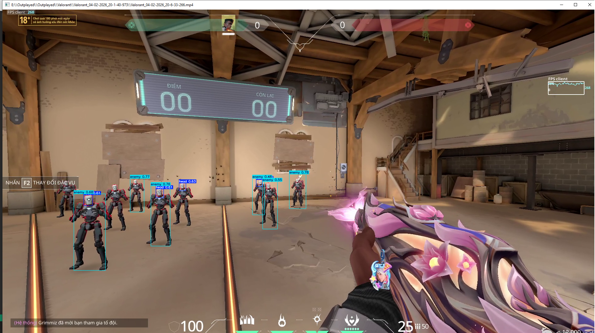
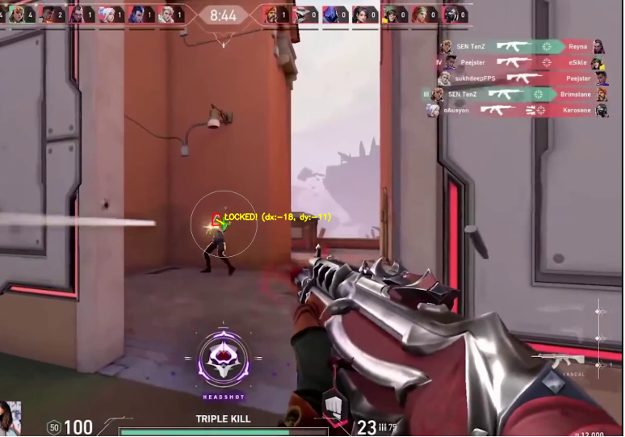
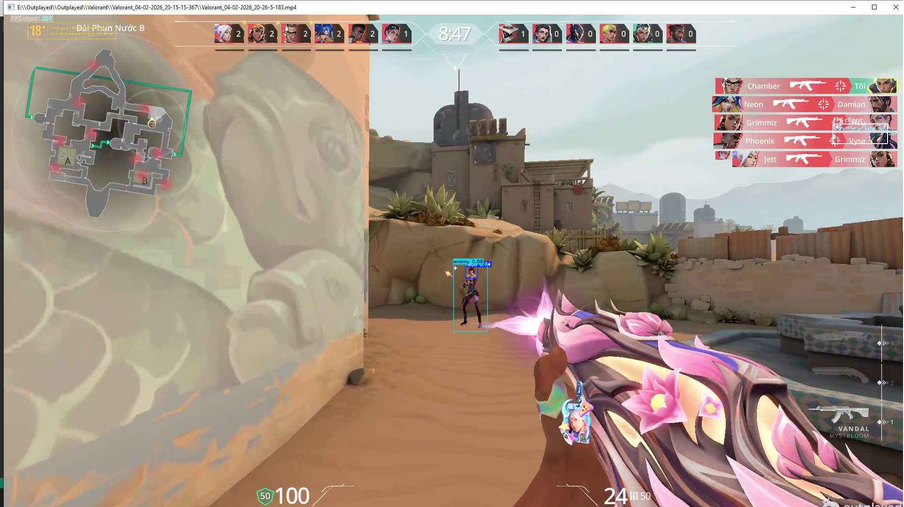
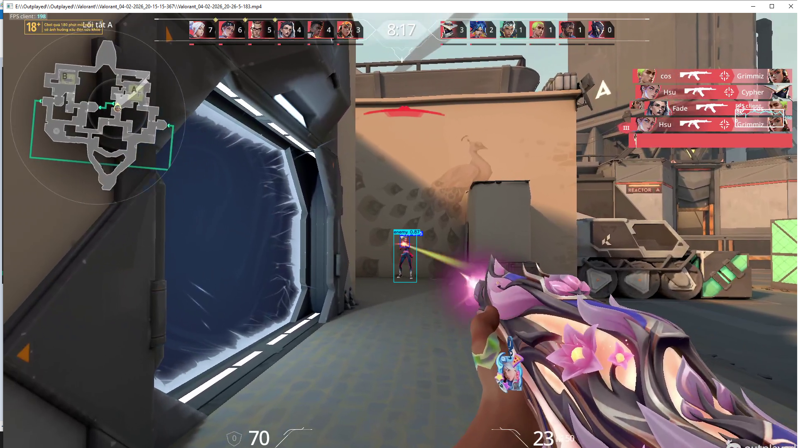
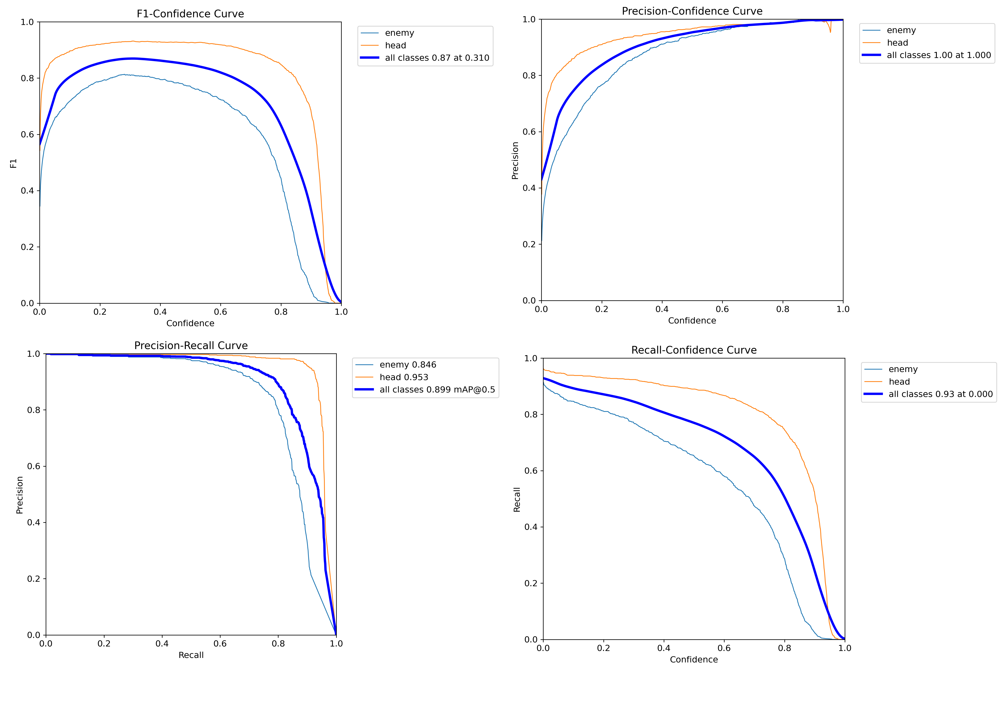

# 🎯 Valorant Enemy & Head Detection

<p align="center">
  
  
  
  
</p>

Dự án sử dụng mô hình **YOLO26 Nano** đã được fine-tune để nhận diện **kẻ địch (enemy)** và **đầu kẻ địch (head)** trong tựa game **VALORANT** của Riot Games.

> ⚠️ **Disclaimer:** Dự án này được xây dựng **chỉ phục vụ mục đích học tập và nghiên cứu** về Computer Vision & Object Detection. **KHÔNG** sử dụng trong game thực tế dưới bất kỳ hình thức nào (aimbot, wallhack, ...). Việc sử dụng phần mềm cheat vi phạm điều khoản dịch vụ của Riot Games và có thể dẫn đến **ban tài khoản vĩnh viễn**.

---
## Demo




## 📋 Mục lục

- [Tổng quan](#-tổng-quan)
- [Các lớp nhận diện (Classes)](#-các-lớp-nhận-diện-classes)
- [Cấu trúc dự án](#-cấu-trúc-dự-án)
- [Cài đặt](#-cài-đặt)
- [Hướng dẫn sử dụng](#-hướng-dẫn-sử-dụng)
- [Quá trình huấn luyện](#-quá-trình-huấn-luyện)
- [Kết quả huấn luyện](#-kết-quả-huấn-luyện)
- [Công cụ hỗ trợ](#-công-cụ-hỗ-trợ)

---

## 🔍 Tổng quan

| Thông tin | Chi tiết |
|---|---|
| **Mô hình** | YOLO26 Nano (fine-tuned) |
| **Task** | Object Detection |
| **Input** | Video gameplay Valorant (`.mp4`, `.avi`, `.mkv`) |
| **Output** | Bounding box xung quanh enemy & head |
| **Image Size** | 640×640 |
| **Nền tảng huấn luyện** | Kaggle (2× GPU) |

---

## 🏷️ Các lớp nhận diện (Classes)

| ID | Tên lớp | Mô tả |
|:---:|:---:|---|
| `0` | `enemy` | Toàn bộ thân hình kẻ địch (bao gồm viền màu đỏ/vàng/tím highlight) |
| `1` | `head` | Đầu kẻ địch (vùng headshot) |

---

## 📁 Cấu trúc dự án

```
Valorant_Detect/
│
├── main.py                  # 🎮 App chính - GUI test model trên video
├── model_trainning.py       #  Script huấn luyện model (chạy trên Kaggle)
├── check.py                 # 🔎 Tool kiểm tra nhãn (label) trên ảnh
├── data_standard.py         # 🔧 Tool chuẩn hóa dataset (đổi tên class, remap ID)
│
├── models/                  # 📦 Thư mục chứa model weights
│   ├── yolo26n.pt           #    Model gốc YOLO26 Nano (pretrained)
│   └── best.pt              #    Model đã fine-tune (best checkpoint)
│
├── valorant_head_dataset/   # 📂 Dataset (không push lên Git)
│   ├── data.yaml            #    Cấu hình dataset (classes, paths)
│   ├── train/               #    Ảnh + nhãn train
│   ├── valid/               #    Ảnh + nhãn validation
│   └── test/                #    Ảnh + nhãn test
│
├── results/                 # 📊 Kết quả huấn luyện
│   └── Valorant_AI/
│       └── yolo26n_head_v1/ #    Metrics, biểu đồ, confusion matrix
│
├── .gitignore
└── README.md
```

---

## ⚙️ Cài đặt

### Yêu cầu hệ thống

- Python **3.10+**
- GPU có hỗ trợ CUDA (khuyến nghị, không bắt buộc)

### Cài đặt thư viện

```bash
pip install ultralytics opencv-python pyyaml
```

---

## 🚀 Hướng dẫn sử dụng

### 1. Chạy nhận diện trên video (GUI)

```bash
python main.py
```

Giao diện sẽ hiện lên cho phép bạn:

1. **Chọn model** (`.pt`) — chọn file `models/best.pt` 
2. **Chọn video** gameplay Valorant
3. **Điều chỉnh Confidence** — ngưỡng độ tự tin (mặc định `0.4`)
4. **Bật/tắt lưu video** kết quả
5. Bấm **"BẮT ĐẦU NHẬN DIỆN"** → cửa sổ video real-time xuất hiện
6. Bấm phím **`Q`** để dừng xem sớm

### 2. Huấn luyện lại model

> ⚠️ Khuyến nghị chạy trên **Kaggle** hoặc máy có GPU mạnh.

```bash
python model_trainning.py
```

Chỉnh sửa các tham số trong file trước khi chạy:
- `data` — đường dẫn tới `data.yaml`
- `epochs` — số epoch (mặc định `150`)
- `batch` — batch size (mặc định `16`, tăng nếu GPU đủ VRAM)
- `device` — `0` cho 1 GPU, `0,1` cho 2 GPU

---

## Quá trình huấn luyện

### Cấu hình huấn luyện

| Tham số | Giá trị | Ghi chú |
|---|---|---|
| Base model | `yolo26n.pt` | YOLO26 Nano pretrained trên COCO |
| Epochs | `150` | Với patience = 30 (early stopping) |
| Image size | `640` | Cân bằng giữa tốc độ và độ chính xác |
| Batch size | `32` | Chạy trên Kaggle 2×GPU |
| Optimizer | `auto` | Ultralytics tự chọn optimizer tối ưu |
| AMP | `true` | Mixed precision để tiết kiệm VRAM |

### Chiến lược Data Augmentation

Augmentation được thiết kế **riêng cho ngữ cảnh game Valorant**:

| Augmentation | Giá trị | Lý do |
|---|:---:|---|
| `hsv_h` | `0.015` | Giữ nguyên màu viền đỏ/vàng/tím đặc trưng của enemy |
| `hsv_s` | `0.45` | Tăng độ đậm để viền kẻ địch nổi bật hơn |
| `hsv_v` | `0.4` | Mô phỏng map tối/sáng khác nhau (Abyss, Split, ...) |
| `degrees` | `0.0` | Agent **luôn đứng thẳng**, không cần xoay |
| `flipud` | `0.0` | **Tuyệt đối không lật dọc** (agent không đi bằng đầu) |
| `fliplr` | `0.5` | Lật ngang 50% (địch thò đầu trái/phải) |
| `mosaic` | `1.0` | Luôn bật — tăng khả năng nhận diện vật thể nhỏ |
| `copy_paste` | `0.3` | Dán thêm object vào ảnh — tăng đa dạng |
| `erasing` | `0.4` | Mô phỏng enemy bị che khuất sau vật cản |
| `mixup` | `0.0` | Tắt — tránh làm mờ viền màu đặc trưng |

---

## 📊 Kết quả huấn luyện

Kết quả được lưu tại `results/Valorant_AI/yolo26n_head_v1/`:


| File | Mô tả |
|---|---|
| `results.png` | Biểu đồ loss & metrics qua các epoch |
| `confusion_matrix.png` | Ma trận nhầm lẫn |
| `BoxF1_curve.png` | Đồ thị F1-Score theo confidence |
| `BoxPR_curve.png` | Đồ thị Precision-Recall |
| `BoxP_curve.png` | Đồ thị Precision theo confidence |
| `BoxR_curve.png` | Đồ thị Recall theo confidence |
| `labels.jpg` | Phân bố nhãn trong dataset |

---

## 🔧 Công cụ hỗ trợ

### Kiểm tra nhãn (`check.py`)

```bash
python check.py
```

Tool GUI giúp **kiểm tra trực quan** nhãn YOLO trên ảnh:
- Chọn 1 hoặc nhiều ảnh cùng lúc
- Tự động tìm file `.txt` tương ứng
- Vẽ bounding box với màu sắc theo class (🔵 head / 🔴 enemy)
- Phím `Q` → ảnh tiếp theo, `ESC` → thoát

### Chuẩn hóa Dataset (`data_standard.py`)

```bash
python data_standard.py
```

Tool GUI giúp **remap class ID** khi gộp nhiều dataset khác nhau:
- Load `data.yaml` để xem danh sách class hiện tại
- Đổi tên class và tự động cập nhật toàn bộ file `.txt` (train/val/test)
- Ghi đè lại `data.yaml` với thông tin mới

---

## 📜 License

Dự án này được phát hành dưới mục đích **nghiên cứu và học tập**. Mọi hành vi sử dụng sai mục đích là trách nhiệm của người dùng.

---
## Authors
GitHub: [thainv299](https://github.com/thainv299)
<p align="center">
  <b>Made with ❤️ for Computer Vision Research</b>
</p>
